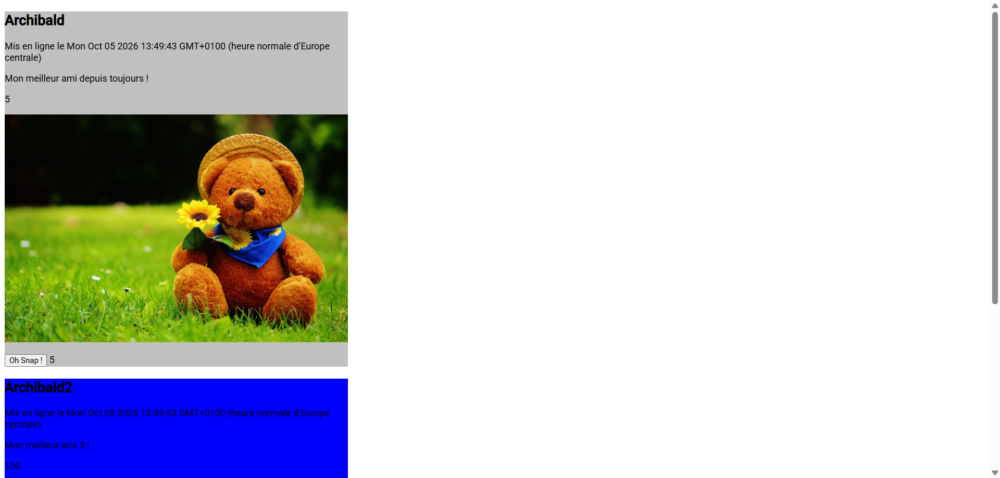

# TP1 Angular - Snapface 📸

Bienvenue sur le projet **Snapface**, une application web développée avec **Angular 18** (Standalone Components). 
Ce projet est réalisé dans le cadre du premier travail pratique (TP1) Angular pour pratiquer les concepts fondamentaux du framework.

---

## 📸 Aperçu / Screenshot



---

## 🚀 Fonctionnalités & Concepts étudiés

- **Standalone Components** : Utilisation des composants autonomes d'Angular 18.
- **Data Binding** :
  - *String Interpolation* (`{{ title }}`)
  - *Property Binding* (`[ngClass]`, `[ngStyle]`, `[src]`)
  - *Event Binding* (`(click)="onSnap()"`)
- **Directives & Pipes** :
  - `ngClass` : Modification dynamique des classes CSS (ex: changement de fond si le nombre de snaps ≥ 100).
  - `ngStyle` : Style inline dynamique basé sur les données.
  - `UpperCasePipe` : Formatage des textes.
- **Communication entre composants** :
  - Transmissions de données via l'anotation `@Input()`.

---

## 🛠️ Installation et Lancement

### 1. Prérequis
Assurez-vous d'avoir **Node.js** et **npm** installés.

### 2. Installation des dépendances
```bash
npm install
```

### 3. Lancer le serveur de développement
```bash
ng serve
```
Rendez-vous sur [http://localhost:4200/](http://localhost:4200/). L'application s'actualisera automatiquement lors de toute modification des fichiers sources.

---

## 📁 Structure du Projet

```text
snapface/
├── Scrinshoute/
│   └── screenshot-2026-10-05-134956.png
├── src/
│   └── app/
│       ├── face-snap/
│       │   ├── face-snap.component.ts
│       │   ├── face-snap.component.html
│       │   └── face-snap.component.scss
│       ├── app.component.ts
│       ├── app.component.html
│       └── app.component.scss
├── README.md
└── package.json
```

---

## 📝 Commandes utiles

- `ng build` : Compiler le projet pour la production dans le dossier `dist/`.
- `ng test` : Exécuter les tests unitaires via Karma.
